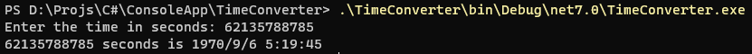
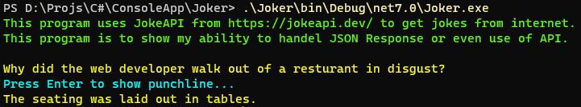
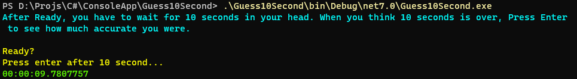
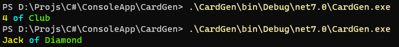

# TimeCalculator
This project shows i can use controll statements and I can calculate. 
 
<code>> .\TimeConverter\bin\Debug\net7.0\TimeConverter.exe</code> 
# Joker
This program uses JokeAPI from https://jokeapi.dev/ to get jokes from internet. 
This program is to show my ability to handel JSON Response or even use of API. 
 
<code>> .\Joker\bin\Debug\net7.0\Joker.exe</code>
# Guess 10 Second
This program uses DateTime.Now; I can use it to calcuate how much optimized the software is. Lower the offset, the better. 
 
<code>> .\Guess10Second\bin\Debug\net7.0\Guess10Second.exe</code> 
# Card Gen
This program shows that i can work with key value mapping datatype like Dictionary. 
 
<code>> .\CardGen\bin\Debug\net7.0\CardGen.exe</code> 
# Rock Paper Scissors
This program is to show i can handle and validate userinput. User can do anything and we have to be extremely catious about unintended usage. 
 
<code>> .\RockPaperScissors\bin\Debug\net7.0\RockPaperScissors.exe</code>